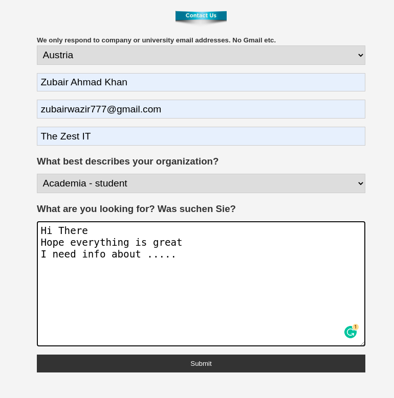

# Python Feedback App

> Python Flask Feedback app that sends data to Postgres database and emails user

[](https://zubairwazir/flask-contact-form-with-mail-function/static/contact.png)

# Live Site

[Click to Watch Live Demo](https://shiny-atlantic-17099.herokuapp.com/)


## Quick Start

```bash
# Add your DATABASE URI in app.py and your mail params in send_mail.py

# Install dependencies
pipenv shell
pipenv install

# Serve on localhost:5000
python app.py
```

### Heroku Deployment Steps

https://gist.github.com/bradtraversy/0029d655269c8a972df726ed0ac56b88
